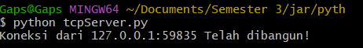
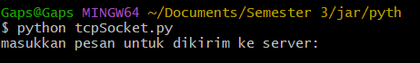
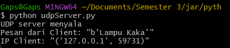
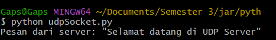

<div align="center">

# 🌐 Socket Programming: TCP & UDP
### *Panduan Lengkap Komunikasi Jaringan dengan Python*


**Pelajari dasar-dasar networking dengan implementasi praktis protokol TCP dan UDP!**

</div>

---

## 📋 Daftar Isi

- [🎯 Tentang Proyek](#-tentang-proyek)
- [✨ Fitur Utama](#-fitur-utama)
- [🔍 Pemahaman Protokol](#-pemahaman-protokol)
- [⚔️ TCP vs UDP](#️-tcp-vs-udp)
- [🚀 Quick Start](#-quick-start)
- [📁 Struktur Proyek](#-struktur-proyek)
- [💡 Tips & Troubleshooting](#-tips--troubleshooting)

---

## 🎯 Tentang Proyek

Proyek ini adalah **hands-on learning experience** untuk memahami konsep dasar networking! Dengan implementasi sederhana namun powerful, kamu akan belajar:

- 🔌 Bagaimana client dan server berkomunikasi
- 📡 Perbedaan fundamental TCP dan UDP
- 🐍 Socket programming dengan Python
- 🛠️ Praktik terbaik dalam network programming

> **Perfect untuk:** Mahasiswa, Developer Pemula, atau siapa saja yang ingin memahami networking dari ground zero!

---

## ✨ Fitur Utama

<table>
<tr>
<td width="50%">

### 🔐 TCP Implementation
- ✅ Connection-oriented protocol
- ✅ Reliable data transmission
- ✅ Error checking & correction
- ✅ Ordered data delivery
- ✅ Perfect untuk aplikasi critical

</td>
<td width="50%">

### ⚡ UDP Implementation
- ✅ Connectionless protocol
- ✅ Lightning-fast transmission
- ✅ Low overhead
- ✅ Broadcast support
- ✅ Ideal untuk real-time apps

</td>
</tr>
</table>

---

## 🔍 Pemahaman Protokol

### 🔐 TCP (Transmission Control Protocol)

> **"Seperti menelepon teman - harus ada sambungan dulu sebelum bicara!"**

TCP adalah protokol yang **memastikan data sampai dengan aman dan berurutan**. Bayangkan seperti mengirim paket via JNE - ada tracking, konfirmasi penerimaan, dan jaminan sampai tujuan.

#### 📡 **tcpServer.py** - Sang Penjawab
```python
🔹 Membuat socket TCP (SOCK_STREAM)
🔹 Binding ke 127.0.0.1:12345
🔹 Listen dengan queue 5 koneksi
🔹 Loop terus-menerus menerima client
🔹 Accept koneksi & tampilkan info client
🔹 Terima pesan (1024 bytes)
🔹 Decode UTF-8 → uppercase → encode kembali
🔹 Kirim balik ke client & tutup koneksi
```

**Contoh Flow:**
```
Client mengirim: "hello world"
→ Server menerima: "hello world"
→ Server proses: "HELLO WORLD"
→ Server kirim balik: "HELLO WORLD"
```

#### 💻 **tcpSocket.py** - Sang Penanya
```python
🔹 Membuat socket TCP (SOCK_STREAM)
🔹 Connect ke 127.0.0.1:12345
🔹 Input pesan dari user: "masukkan pesan untuk dikirim ke server"
🔹 Encode UTF-8 & kirim ke server
🔹 Terima response (1024 bytes)
🔹 Decode & tampilkan: "Server response: [HASIL]"
```

#### 🎯 Kapan Menggunakan TCP?
- 📧 Email & messaging
- 🌐 Web browsing (HTTP/HTTPS)
- 📂 File transfer (FTP)
- 🔐 Aplikasi yang butuh keamanan data

---

### ⚡ UDP (User Datagram Protocol)

> **"Seperti siaran radio - langsung broadcast tanpa peduli siapa yang dengar!"**

UDP adalah protokol **cepat tanpa jaminan**. Seperti melempar bola ke teman - kalau dia nangkap, bagus! Kalau tidak, ya sudah lanjut.

#### 📡 **udpServer.py** - Stasiun Penerima
```python
🔹 Membuat socket UDP (SOCK_DGRAM)
🔹 Binding ke 127.0.0.1:9997
🔹 Print "UDP server menyala"
🔹 Loop infinite menunggu data
🔹 Terima data dengan recvfrom(1024)
🔹 Tampilkan pesan & IP client
🔹 Kirim "Selamat datang di UDP Server" ke client
🔹 Tidak perlu close koneksi (connectionless!)
```

**Contoh Flow:**
```
Client kirim: "Lampu Kaka"
→ Server terima & tampilkan: "Pesan dari Client: b'Lampu Kaka'"
→ Server tampilkan: "IP Client: ('127.0.0.1', random_port)"
→ Server kirim: "Selamat datang di UDP Server"
```

#### 💻 **udpSocket.py** - Stasiun Pengirim
```python
🔹 Membuat socket UDP (SOCK_DGRAM)
🔹 Langsung sendto() ke 127.0.0.1:9997
🔹 Kirim pesan: "Lampu Kaka" (hardcoded)
🔹 Terima balasan dengan recvfrom(4096)
🔹 Decode & print: "Pesan dari server: [RESPONSE]"
🔹 Close socket
```

#### 🎯 Kapan Menggunakan UDP?
- 🎮 Online gaming
- 📹 Video streaming (YouTube, Netflix)
- 🎤 VoIP (Zoom, Discord)
- 📺 Live broadcasting

---

## ⚔️ TCP vs UDP

<div align="center">

| 🎯 **Aspek** | 🔐 **TCP** | ⚡ **UDP** |
|:-------------|:-----------|:-----------|
| **Koneksi** | 🤝 Harus handshake dulu | 🚀 Langsung kirim |
| **Keandalan** | ✅ Dijamin sampai | ⚠️ Bisa hilang di jalan |
| **Kecepatan** | 🐢 Lebih lambat (overhead) | ⚡ Super cepat |
| **Urutan** | 📊 Terurut rapi | 🎲 Bisa acak |
| **Error Checking** | 🔍 Ketat & teliti | 🤷 Minimal |
| **Overhead** | 📦 Berat (header besar) | 🪶 Ringan |
| **Use Case** | 💼 Banking, Email, Web | 🎮 Gaming, Streaming |
| **Analogi** | 📞 Telepon | 📻 Radio |

</div>

---

## 🚀 Quick Start

### 📋 Prerequisites

```bash
✅ Python 3.x installed
✅ Basic terminal/command prompt knowledge
✅ Text editor (VS Code, PyCharm, etc.)
```

### 🔐 Menjalankan TCP Demo

#### **Step 1:** Jalankan Server
```bash
python tcpServer.py
```
**Output Server:**
```
(Menunggu koneksi...)
Koneksi dari 127.0.0.1:xxxxx Telah dibangun!
```



#### **Step 2:** Jalankan Client (Terminal Baru)
```bash
python tcpSocket.py
```
**Interaksi:**
```
masukkan pesan untuk dikirim ke server: hello world
Server response: HELLO WORLD
```

**✨ Coba kirim pesan lain:**
- Input: `python programming` → Response: `PYTHON PROGRAMMING`
- Input: `jaringan komputer` → Response: `JARINGAN KOMPUTER`



---

### ⚡ Menjalankan UDP Demo

#### **Step 1:** Jalankan Server
```bash
python udpServer.py
```
**Output Server:**
```
UDP server menyala
(Menunggu data...)
Pesan dari Client: "b'Lampu Kaka'"
IP Client: "('127.0.0.1', 52431)"
```



#### **Step 2:** Jalankan Client (Terminal Baru)
```bash
python udpSocket.py
```
**Output Client:**
```
Pesan dari server: "Selamat datang di UDP Server"
```



**📝 Catatan Penting:** 
- Client mengirim pesan fixed: `"Lampu Kaka"`
- Server membalas: `"Selamat datang di UDP Server"`
- Port yang digunakan: **9997** (bukan 12345!)
- Untuk customize pesan, edit `client.sendto(b"Pesan Anda",...)` di udpSocket.py

---

## 📁 Struktur Proyek

```
📦 Socket-Programming/
┣ 📜 README.md           ← You are here!
┣ 📄 tcpServer.py        ← TCP Server
┣ 📄 tcpSocket.py        ← TCP Client
┣ 📄 udpServer.py        ← UDP Server
┗ 📄 udpSocket.py        ← UDP Client
```

---

## 💡 Tips & Troubleshooting

### ⚠️ Common Issues

<details>
<summary><b>🔴 Port sudah digunakan?</b></summary>

```bash
# Cek port TCP (12345) atau UDP (9997)
netstat -ano | findstr :12345
netstat -ano | findstr :9997

# Ganti port di file server:
# TCP: ubah variabel 'port' di tcpServer.py
# UDP: ubah variabel 'localPort' di udpServer.py
```

**Port yang digunakan:**
- TCP Server: `12345`
- UDP Server: `9997`
</details>

<details>
<summary><b>🔴 Connection refused?</b></summary>

**Solusi:**
1. ✅ Pastikan server sudah running LEBIH DULU
2. ✅ Check firewall settings
3. ✅ Pastikan IP & port match
</details>

<details>
<summary><b>🔴 Module not found?</b></summary>

```bash
# Socket adalah built-in Python, tidak perlu install
# Kalau tetap error, coba:
python --version  # Pastikan Python 3.x
```
</details>

### 🎓 Best Practices

- ✨ **Selalu jalankan server dulu** sebelum client
- 🛑 **Gunakan `Ctrl+C`** untuk stop server dengan aman
- 🌐 **Untuk testing antar PC:**
  - TCP: Ganti variabel `ip` di tcpSocket.py dengan IP server
  - UDP: Ganti variabel `Target_host` di udpSocket.py dengan IP server
  - Contoh: `192.168.1.100`
- 🔒 **Port conflicts?** 
  - TCP menggunakan port `12345`
  - UDP menggunakan port `9997`
  - Pilih port > 1024 (non-privileged)
- 📝 **Customize pesan UDP?** 
  - Edit di udpSocket.py: `client.sendto(b"Pesan Anda",...)`
  - Tambahkan `input()` untuk pesan dinamis seperti di TCP

### 🚀 Next Steps

Setelah menguasai basic:
1. 🔐 Tambahkan encryption (SSL/TLS)
2. 🧵 Implement multi-threading untuk multiple clients
3. 📦 Buat protocol custom untuk aplikasi spesifik
4. 🎯 Build aplikasi real: chat app, file transfer, dll

---

<div align="center">

### 🌟 Happy Networking! 🌟

**Made with ❤️ for Learning**

*"The best way to learn networking is to build it yourself!"*

---

[](https://www.python.org/)

</div>
